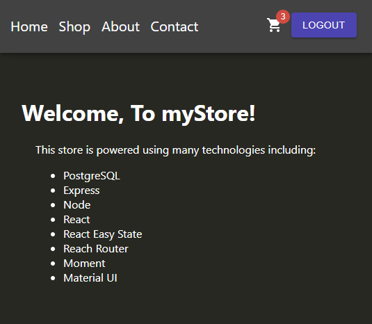
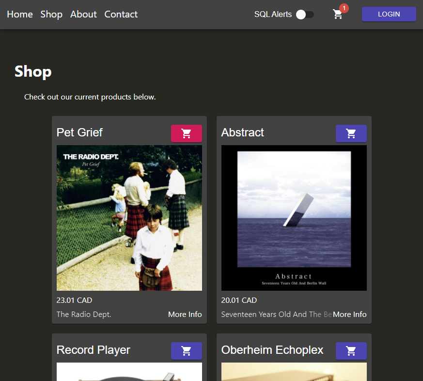
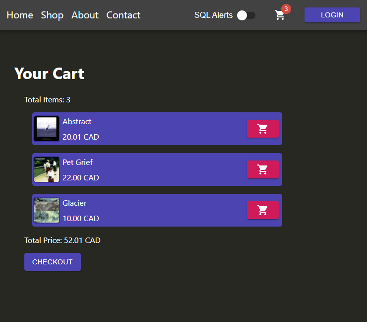

## Summary

An e-commerce web app I am working on. This is still in the very early stages of development. I am using this project:
- As a means to become familiar with JS PostgreSQL libraries and JS REST API's.
- To learn which web technologies make development easier and more efficient.
- As an opportunity to implement an appealing, modern front end.
- To learn about e-commerce using the Stripe API.

## Preview

## Gallery

#### Shop

#### Cart

