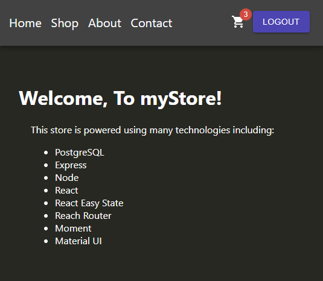

An e-commerce web app I am working on. This is still in the very early stages of development. I am using this project:
- as a means to become familiar with JS PostgreSQL libraries and JS REST API's
- to learn which web technologies make development easier and more efficient
- as an opportunity to implement an appealing modern front end
- to learn about e-commerce using the Stripe API.

Below is a preview of what things are looking like right now.

